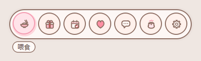
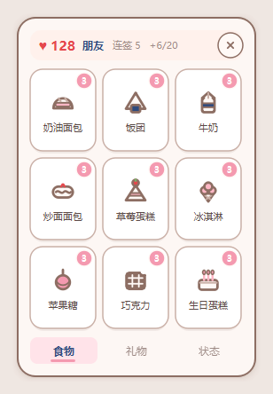
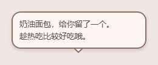
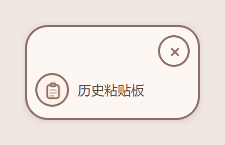
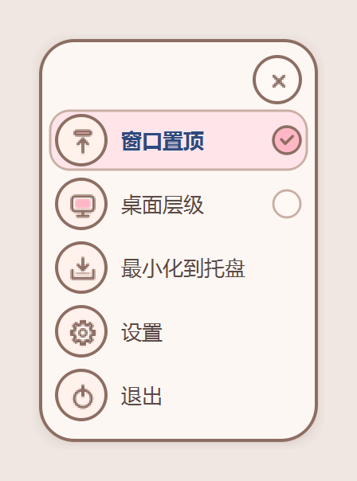
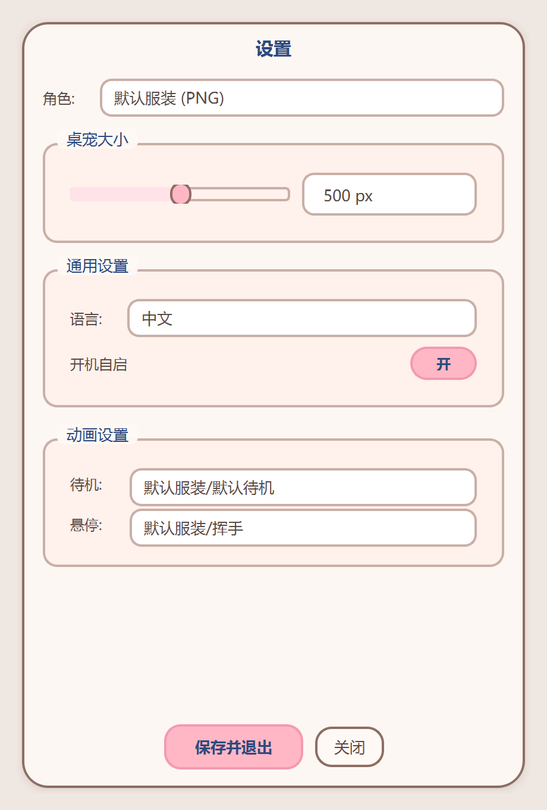
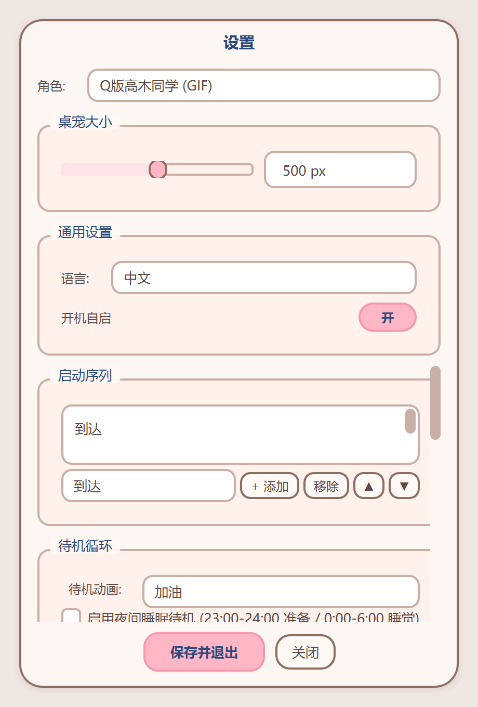
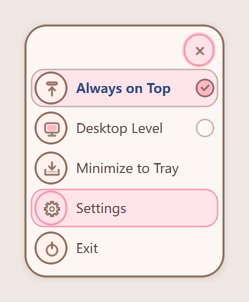

# 🐾 DesktopPet-Takagi-san — Windows 可交互桌面宠物

<div align="center">

**一只住在你桌面上的高木同学（Takagi），会对你的一举一动做出反应 —— 而且现在能养了。**

[](https://www.python.org/)
[](https://wiki.qt.io/Qt_for_Python)
[](https://www.microsoft.com/windows)
[](LICENSE)
[](#-开发)

</div>

---

## 🎬 效果展示

### 默认服装 (PNG 帧动画)

<p align="center">
  
  <br><em>▲ 默认服装角色 — 待机 / 挥手 / 打哈欠</em>
</p>

### Q版高木同学 / Takagi (GIF 动图)

<p align="center">
  
  <br><em>▲ Q版高木同学（Takagi）— 36 种动画，完整交互状态机</em>
</p>

---

## 📖 项目简介

**DesktopPet-Takagi-san** 是一款 Windows 桌面宠物应用，使用 **Python + PySide6** 开发。它会在桌面上显示一只可爱的 **高木同学（Takagi）** 角色——透明无边框窗口悬浮显示，支持两种角色类型，能够响应鼠标悬停、点击、拖拽，还能检测键盘输入和系统音频播放，做出丰富的互动反应。

项目采用**策略模式**设计角色系统，PNG 帧动画角色和 GIF 动图角色共享统一的抽象接口，可运行时热切换。

在此之上还有两层：

- 🍰 **养成层**（「养高木同学」）——悬停菜单喂食 / 送礼 / 签到、好感度、纯本地台词库与对话气泡
- 🎨 **统一视觉**——全应用同一套「暖粉奶白手绘风」，色板只有一个来源

---

## 🆕 最近更新

> 这一轮开发**新增了养成系统**、**把整个界面换了肤**、**加了前台窗口感知**。
> 分阶段进度与暂停点见 [docs/nurture/04-开发步骤.md](docs/nurture/04-开发步骤.md)。

| 更新 | 状态 |
|------|------|
| 🍰 **养成高木同学**（悬停菜单 · 喂食 · 好感度 · 签到 · 台词 · 彩蛋） | 阶段 A~E **已实机验收** ✅ / F、G 代码完成、实机验收待做 🚧 |
| 🎨 **全局换肤**：暖粉奶白手绘风（左右键面板 + 设置窗口） | 已完成 ✅ |
| 🖥️ **前台窗口感知**（隐私优先，默认关闭） | 代码完成 ✅ / 实机验收待做 🚧 |
| 🐛 **交互修订**：悬停菜单不再「吃掉」单击 | 已完成 ✅ |

### 🍰 新增：养成高木同学（Nurture）

鼠标在人物身上**停留 600ms**，头顶就会浮出一排圆形按钮——喂食、送礼、签到、看好感度、陪她聊聊、摸头：

<p align="center">
  
  <br><em>▲ 悬停菜单（当前悬停「喂食」，提示条在胶囊下方）</em>
</p>

<p align="center">
  
  
  <br><em>▲ 左：养成面板「食物」页（库存角标 + 好感度头栏） / 右：送出后的对话气泡</em>
</p>

| 能力 | 说明 |
|------|------|
| 🍱 **13 种食物与礼物** | 4 普通 / 4 稀有 / 5 珍贵，每种带专属反应动画 |
| ❤️ **好感度** | 只升不降，六级称号（认识 → 同桌 → 朋友 → 要好 → 特别 → 最重要的人），逐级解锁菜单项与台词组 |
| 📅 **每日签到** | 连签 3 / 7 / 14 / 30 天有里程碑奖励；时间回退不会刷连签 |
| 💬 **37 个场景的台词库** | 100% 本地 JSON，**不用 AI 生成、不联网**；三档语气（温柔 / 调皮 / 小得意） |
| 🥚 **四种彩蛋** | 整点、长待机、首次使用、节日与生日 |
| 🔒 **不打扰** | 对话气泡与所有面板**都不抢输入焦点**、鼠标可穿透；四项开关各自独立 |

> **明确不做**：饥饿值、心情值、生病、死亡、掉好感。走「轻养成」——不理她不会有任何惩罚。
> 详见 [docs/nurture/01-需求规格.md](docs/nurture/01-需求规格.md)。

### 🎨 界面换肤：冷蓝磨砂 → 暖粉奶白手绘

原本只有养成系统是暖色手绘风，其余界面还是冷蓝磨砂玻璃。现在**全部统一**成一套：

| | 之前 | 现在 |
|---|------|------|
| 左右键面板 | QLabel 文字条 + 冷蓝 QSS | **全自绘**：奶白纸片 + 2px 暖棕描边 + 20px 圆角 + 暖色投影；每行 = 30px 圆形矢量图标 + 文案 |
| 勾选项 | `✓ ` 文字前缀 | 右侧**圆形勾选指示**（选中 = 粉底 + 暖棕勾 + 藏青粗体） |
| 设置窗口 | 冷蓝磨砂玻璃 | 自绘外壳 + **纸片分组卡** + 藏青粗体标题 |
| 图标 | emoji | **27 个内置矢量图标**（面板行 / 悬停菜单 / 食物礼物），三级降级链 |

<p align="center">
  
  
  <br><em>▲ 左键功能面板 / 右键系统面板（同一套纸片与高亮）</em>
</p>

<p align="center">
  
  
  <br><em>▲ 设置窗口：左 = 默认服装页 / 右 = Q版页</em>
</p>

> **改主题的正确姿势**：色板与笔触的唯一来源是 `src/ui_theme.py`
> （`paint_paper` / `paint_card` / `paint_row` / `paint_circle` …），改一处全局生效。
> 冷蓝色由 `tests/test_nurture_icons.py` 做**源码级扫描**拦住，写死旧色值会直接测试失败。

### 🖥️ 前台窗口感知（隐私优先，默认关闭）

她能知道你在**用哪一类**应用，并说一句应景的话（分类命中后 20~30 分钟冷却，不会反复念叨）：

| 分类 | 例子（`apps.json` 里共 223 条进程名） | 她会说什么（真实台词） |
|------|----------------------------------------|------------------------|
| 💻 代码 | `code.exe` / `cursor.exe` / `zed.exe` | 「看起来在忙呢。」「专心的时候我不吵。」 |
| 🌐 浏览器 | `chrome.exe` / `msedge.exe` | 「翻得挺快的。」「我不偷看的。」 |
| 🎮 游戏 | `steam.exe` 及 65 条游戏进程 | 「我在旁边陪着。」「玩得开心就好。」 |
| 📞 会议 | `zoom.exe` / `teams.exe` / 飞书 | 「在开会呀。」「静音会更稳些。」 |
| 🎬 影音 | `vlc.exe` / `potplayer.exe` | 「有声音呢。」「我一起听。」 |

> 每一句都**没有宾语**——她知道你在写代码，但不知道也不问你在写什么。"说不出内容，也就无从评判"。

**隐私边界（写进测试的硬约束）**：

- **默认关闭**：开关关着时**连监控对象都不创建**（不是"创建了但不发信号"）
- **不读窗口标题**、不记录你在看什么内容、不截屏、不联网、不写日志文件
- 只把进程名映射成 5 个分类之一，命中「不要感知」黑名单（26 条，含密码管理器）一律当作"不认识"
- **全屏时静默**：检测到全屏（打游戏 / 看视频）就不再主动说话
- 关掉开关即停止轮询，不留后台线程

> 目前通过 `config.json` 的 `"allow_foreground_detection": true` 开启并重启生效；
> 设置页里的开关排在**阶段 H**。

### 🐛 交互修订：悬停菜单不再「吃掉」单击

原本有一条裁定是「悬停菜单开着时，单击 = 只收起菜单」，实际用起来变成了
**"鼠标一放到人物身上弹出喂养菜单，就再也点不出功能面板了"**——而同一个局面下右键是能弹出系统面板的。

现在**单击永远等于「惊吓 + 弹出功能面板」**，悬停菜单开着时也一样（只是顺带被收起），左右键行为一致。

---

## ✨ 核心功能

### 🎭 双角色系统

| 角色 | 类型 | 播放引擎 | 素材来源 |
|------|------|----------|----------|
| **默认服装** | PNG 帧序列 | QTimer 驱动，5 秒循环 | `assets/默认服装/` |
| **Q版高木同学 (Takagi)** | GIF 动图 | QMovie 原生播放 | `素材库/高木同学Q版gif/` (36 个动画) |

<p align="center">
  
  
  <br><em>▲ 左：默认服装 (PNG) / 右：Q版高木同学 Takagi (GIF)</em>
</p>

> **🔄 运行时热切换**：在设置窗口中选择角色类型，无需重启即可切换角色。

---

### 🎬 GIF 角色交互系统（Q版高木同学 / Takagi）

Q版高木同学（Takagi）拥有完整的状态机，包含 **36 种动画**，能够对你的操作做出丰富反应：

```
启动序列 → 待机循环 ⇄ 互动状态
                 ↕
            悬停待机
```

#### 🖱️ 鼠标交互

| 操作 | 触发动画 | 说明 |
|------|----------|------|
| 鼠标悬停 | 😳 害羞 | 鼠标移到角色身上 |
| 悬停 600ms | 🍚 悬停菜单 | 养成菜单（可用「菜单弹出后禁用长悬停问号」关掉干扰） |
| 悬停 3 秒 | ❓ 问号 | 长时间悬停（菜单已弹出时不冒问号） |
| 单击 | 😱 惊吓 | 点击角色，同时弹出左键功能面板 |
| 双击 (400ms 内) | 😠 生气 → 😭 哭 | 链式动画，不可打断 |
| 拖拽移动 | — | 拖动角色到桌面任意位置 |

<p align="center">
  
  
  
  <br><em>▲ 悬停（害羞）/ 单击（惊吓）/ 双击（生气→哭）</em>
</p>

#### 🔍 行为检测

| 检测项 | 触发动画 | 技术实现 |
|--------|----------|----------|
| ⌨️ 键盘输入 | 打字 | `pynput` 全局键盘监听 |
| 🔊 系统音频播放 | 唱歌 | Windows Core Audio API (`IAudioMeterInformation`) |
| 🔇 系统静音 | 静音 | Windows Core Audio API (`IAudioEndpointVolume`) |

<p align="center">
  
  
  <br><em>▲ 键盘打字交互 / 音乐播放交互</em>
</p>

> 💡 键盘检测优先级高于音频检测。

#### 💤 AFK 随机播放

角色空闲 30 秒后，会从**自定义动画池**中随机选取动画播放，之后每 1-3 分钟随机播放一次（均可配置）。

---

### 🍰 养成高木同学（Nurture）

> **仅对 Q版高木同学（GIF）生效**。切到默认服装（PNG）时整个养成系统休眠——不弹菜单、不说气泡、不计时，
> 但**数据保留不丢**，切回来立刻恢复。理由：默认服装的交互行为是本项目的回归红线。

#### 悬停菜单

鼠标在人物身上停留 **600ms** → 头顶浮出圆形按钮条。菜单**不抢输入焦点**，
鼠标移开后还有 **350ms 宽限期**（好让你从容把鼠标移到按钮上）。

| 按钮 | 作用 | 解锁条件 |
|------|------|----------|
| 🍚 喂食 | 打开养成面板「食物」页 | — |
| 🎁 送礼 | 打开养成面板「礼物」页 | — |
| 📅 签到 | 每日签到，拿普通食物 ×2 | — |
| ❤️ 好感度 | 打开养成面板「状态」页 | — |
| 💬 陪她聊聊 | 主动触发一句台词 | 好感度 ≥ 120 |
| 🖐️ 摸头 | 播 `害羞 2` + 专属台词 | 好感度 ≥ 450 |
| ⚙️ 设置 | 打开设置窗口 | — |

#### 数值（只升不降）

| 状态 | 规则 |
|------|------|
| ❤️ **好感度** | 送出普通 / 稀有 / 珍贵 = **+1 / +2 / +4**；连签里程碑额外 +5 / +10 / +20 / +50；**每日上限 20** |
| 🍱 **食物库存** | 按档位分别计数，单类上限 20 / 10 / 5；库存满了仍会记账（只是送不出去） |
| 📅 **连签天数** | 连续签到 +1；断签重置为 1；**本地日期回退不会刷连签** |

**好感度等级**（阈值在 `assets/nurture/levels.json`，可改）：

| 好感度 | 称号 | 解锁 |
|--------|------|------|
| 0 | 认识 | 默认台词组 |
| 50 | 同桌 | 「待机闲聊」台词组 |
| 120 | 朋友 | 菜单新增「陪她聊聊」 |
| 250 | 要好 | 「小得意」语气 + 节日台词组 |
| 450 | 特别 | 菜单新增「摸头」 |
| 700 | 最重要的人 | 「深夜谈心」台词组 + 全部菜单项 |

#### 食物怎么来

| 途径 | 默认规则（全部可配置） |
|------|------------------------|
| 📅 每日签到 | 每天 1 次，普通食物 ×2；连签提升产出品质 |
| ⏳ 陪伴时长 | 每 60 分钟活动时间 → 普通食物 ×1（每天上限 3） |
| ⌨️ 打字兑换 | 每 2000 次按键 → 普通食物 ×1（每天上限 2） |
| 🥚 彩蛋 | 整点（25% 概率，每天上限 3）· 连续待机 10 分钟 · 首次使用 · 节日与生日 |

#### 台词与对话气泡

- **37 个场景**的台词库，全在 `assets/nurture/dialogues/*.json`：**纯本地、不联网、不用 AI 生成**
- 三档语气 `gentle` / `tease` / `proud`，最近 5 条自动防重复
- 对话气泡**自绘**（圆角矩形 + 尾巴合并路径）、贴头顶、最多 4 行、像素级断行
- 主动说话有节流：两条之间至少 **90 秒**；可设**免打扰时段**（默认 23:00–07:00 不出气泡）
- 台词有「不评判」约束（测试会扫描字数 / 标点 / 句式黑名单），她知道你在用 VS Code，但不评论你写的东西

#### 素材驱动

食物、礼物、台词、等级阈值、节日、前台应用分类**全都是外部 JSON**，用户不写代码就能增删：

```
assets/nurture/
├── items.json        # 13 项食物/礼物：档位 / 动画映射 / 图标 / 专属台词
├── checkin.json      # 签到产出与连签里程碑
├── levels.json       # 好感度阈值 50/120/250/450/700 + 称号 + 解锁项
├── events.json       # 节日 / 纪念日 → 产出物品 + 专属台词场景
├── apps.json         # 前台感知：5 分类 × 223 条进程名 + 26 条黑名单
├── dialogues/*.json  # 37 个台词场景
└── icons/README.txt  # 自备图标 PNG 的命名与规格
```

> 素材在**程序启动时**读入，改完**重启生效**。（代码里留了热重载入口 `reload_assets()`，
> 阶段 H 的养成设置页会把它接到「重新载入素材」按钮上。）

---

### 💬 双面板系统

桌宠配有两套面板，分别通过左键和右键触发：

| 面板 | 触发方式 | 弹出位置 | 内容 |
|------|----------|----------|------|
| **功能面板**（左键） | 左键点击角色 | 角色右侧（贴边自动翻左） | 📋 历史粘贴板（可扩展更多功能） |
| **系统面板**（右键） | 右键点击角色 | 鼠标光标位置（类系统菜单） | ⚙ 设置 · 📌 窗口置顶 · 🖥 桌面层级 · ➖ 最小化到托盘 · 🚪 退出 |

<p align="center">
  
  <br><em>▲ 功能面板（奶白纸片 + 圆形矢量图标 + 滑入淡出 220ms）</em>
</p>

> - **系统面板**含窗口置顶 / 桌面层级切换（互斥 radio-like）和最小化到托盘
> - **功能面板**贴角色右侧滑入淡出（220ms），靠近屏幕右边缘自动翻到左侧
> - 两个面板**互斥**，且和悬停菜单、养成面板一起由统一的「面板仲裁器」管理——**同一时刻只有一个弹层可见**
> - **单击 = 惊吓 + 功能面板**（悬停菜单开着时也一样，菜单会顺带收起）

---

### ⚙️ 设置窗口

暖粉奶白手绘风设置窗口，双页面设计 (QStackedWidget)，420×640：

<p align="center">
  
  <br><em>▲ 设置窗口（Q版高木同学 / Takagi 配置页）</em>
</p>

| 设置区域 | 内容 |
|----------|------|
| ⚙️ **通用设置** | 角色类型切换、桌宠大小 (200–800px)、语言切换、开机自启 |
| 🎬 **动画设置** (PNG) | 待机动画选择、悬停动画选择（自动扫描 `assets/` 目录） |
| 🚀 **启动序列** (GIF) | 自定义启动动画链（添加 / 移除 / 排序） |
| 🎭 **行为检测** (GIF) | 按键打字、音频播放、系统静音对应的动画映射 |
| 🖱️ **鼠标交互** (GIF) | 悬停、长悬停、单击、双击链、面板按钮、关闭按钮的动画映射 |
| 💤 **AFK** (GIF) | 启用开关、空闲超时、随机间隔、动画池勾选 |

> 关闭时会自动检测未保存修改并提示。
> 养成系统的专属设置页（食物动画覆盖、签到与彩蛋开关、免打扰时段、台词语气…）排在**阶段 H**，
> 目前这些参数在 `config.json` 的 `nurture` 段里改。

---

### 📋 历史粘贴板

内置剪贴板历史管理器，记录你复制过的文本和图片。窗口为**无边框磨砂卡片**，按正常窗口逻辑运行（出现在任务栏、不置顶、可鼠标缩放、可最小化），并有专属图标。

<p align="center">
  
  <br><em>▲ 历史粘贴板窗口（正常窗口逻辑，可缩放/最小化）</em>
</p>

<p align="center">
  
  <br><em>▲ 历史粘贴板专属图标（项目头像 + 剪贴板角标）</em>
</p>

| 功能 | 说明 |
|------|------|
| 📝 文本记录 | 自动记录复制的文本，支持搜索过滤 |
| 🖼️ 图片记录 | 自动保存剪贴板图片，行内预览 |
| 🔍 实时搜索 | 输入关键词实时过滤记录 |
| ⏱️ 时间筛选 | 1 天 / 3 天 / 5 天 / 全部 |
| 📌 置顶 | 重要记录固定到顶部（橙色边框标识） |
| 🗑️ 删除 | 删除不需要的记录 |
| 📋 回拷 | 点击记录即可重新复制到剪贴板 |
| ♻️ 过期清理 | 可配置保留天数（默认 7 天），自动清理过期记录 |
| 🛡️ 图片去重 | MD5 哈希去重，解决截图工具重复保存问题 |
| 🖥️ 正常窗口 | 出现在任务栏、不置顶、可被遮挡（不再是置顶工具窗） |
| ↔️ 鼠标缩放 | 拖动窗口边缘/四角自适应缩放，排版丝滑跟随 |
| 🔤 字体大小 | ⚙ 设置中全局调整 10-20px（默认 13） |
| 🖼️ 背景壁纸 | ⚙ 设置中上传本地图片作背景底图 + 亚克力磨砂叠层（可调叠层不透明度） |
| 📚 壁纸库 | 历史上传的壁纸以缩略图形式保存在设置中，单击应用 / 删除管理 |
| ➖ 最小化 | 标题栏最小化按钮，从任务栏/托盘可还原 |
| 🎨 专属图标 | 以项目头像为底叠加剪贴板角标，任务栏/标题栏共用 |

> 🎨 **关于配色**：历史粘贴板窗口目前保留自己的一套磨砂卡片外观，**尚未并入新的暖粉奶白主题**。
> 粘板是独立窗口 + 独立文档（`docs/clipboard/`），换肤排在主界面之后。

---

### 🌐 多语言支持

| 语言 | 语言代码 |
|------|----------|
| 🇨🇳 中文 | `zh` |
| 🇬🇧 English | `en` |
| 🇯🇵 日本語 | `ja` |

> 设置窗口与左右键面板的文本键覆盖中/英/日三语，切换即时生效；
> 悬停菜单的 7 个按钮同样是三语。
> （台词库本期仅中文。）

<p align="center">
  
  <br><em>▲ 英文界面下的系统面板</em>
</p>

---

## 📦 安装与运行

### 环境要求

- **Windows 10 / 11**
- **Python 3.10+**（推荐 [python.org](https://www.python.org/downloads/) 下载安装）
- Git（可选，也可直接下载 ZIP）

### 方式一：从源码运行（推荐开发者）

```bash
# 1. 克隆仓库
git clone https://github.com/FormerlyXZ/DesktopPet.git
cd DesktopPet

# 2. （推荐）创建虚拟环境
python -m venv venv
venv\Scripts\activate

# 3. 安装依赖
pip install -r requirements.txt

# 4. 运行
python main.py
# 或双击 DesktopPet.pyw（无终端窗口启动）
```

### 方式二：下载 ZIP 包（推荐普通用户）

1. 访问 https://github.com/FormerlyXZ/DesktopPet
2. 点击绿色的 **Code** 按钮 → **Download ZIP**
3. 解压到任意目录
4. 打开命令行（在解压目录地址栏输入 `cmd` 回车）
5. 执行 `pip install -r requirements.txt`
6. 双击 `DesktopPet.pyw` 或执行 `python main.py`

### 方式三：免安装 EXE（小白用户）

在 [Releases](https://github.com/FormerlyXZ/DesktopPet/releases) 页面下载最新的 `DesktopPet-Takagi-san.zip`，解压后双击 `DesktopPet-Takagi-san.exe` 即可运行。无需安装 Python 或任何依赖。

> 💡 EXE 首次启动较慢（5-10 秒解压），请耐心等待。所有数据保存在 EXE 同目录下。

### 常见安装问题

| 问题 | 解决方法 |
|------|----------|
| `pip` 不是内部命令 | Python 安装时勾选 "Add Python to PATH"，或手动添加环境变量 |
| `pip install` 报错 | 使用国内镜像：`pip install -r requirements.txt -i https://pypi.tuna.tsinghua.edu.cn/simple` |
| 双击 `.pyw` 没反应 | 右键 → 打开方式 → 选择 Python，或直接用命令行 `python main.py` 查看报错 |
| 缺少 VC 运行库 | 下载安装 [VC++ Redistributable](https://aka.ms/vs/17/release/vc_redist.x64.exe) |

### 依赖项

| 包 | 版本 | 用途 |
|----|------|------|
| [PySide6](https://pypi.org/project/PySide6/) | ≥ 6.5.0 | Qt for Python 界面框架 |
| [pynput](https://pypi.org/project/pynput/) | ≥ 1.7 | 全局键盘/鼠标监听 |
| [comtypes](https://pypi.org/project/comtypes/) | ≥ 1.4 | Windows COM 互操作（音频检测） |

> 养成系统**没有引入任何新依赖**：前台窗口感知用 `ctypes` 直接调 Win32 API，台词与图标全在本地。

---

## 🚀 使用指南

### 首次启动

1. 运行 `python main.py` 或双击 `DesktopPet.pyw`
2. 角色将自动出现在桌面右下角（若有多显示器则出现在光标所在屏幕）
3. **右键点击**角色打开系统面板 → 选择"设置"
4. 在设置中选择角色类型、调整大小、配置动画

### 基本操作

| 操作 | 效果 |
|------|------|
| 🖱️ **鼠标悬停** (PNG) | 角色挥手 |
| 🖱️ **鼠标悬停** (GIF / Takagi) | 角色害羞 |
| 👆 **左键单击** | 弹出功能面板（历史粘贴板） |
| 🖱️ **右键单击** | 弹出系统面板（设置/置顶/托盘/退出） |
| ✋ **拖拽** | 移动角色到任意位置 |
| ⚙️ **面板 → 设置** | 打开设置窗口 |
| 🚪 **面板 → 退出** | 关闭桌宠 |

### GIF 角色（Takagi / 高木同学）额外操作

| 操作 | 效果 |
|------|------|
| 👆 **双击（400ms 内）** | 生气 → 哭（链式动画，不可打断） |
| ⌨️ **按键盘任意键** | 角色打字动画 |
| 🔊 **播放音乐/视频** | 角色唱歌动画 |
| 🔇 **系统静音** | 角色静音动画 |
| 💤 **30 秒无操作** | AFK 随机动画播放 |
| 🔔 **系统托盘** | 最小化到托盘，点击托盘图标恢复显示 |

### 🍰 养成玩法（Q版专属）

| 操作 | 结果 |
|------|------|
| ⏸️ **鼠标停在人物上 600ms** | 弹出悬停菜单 |
| 🍚 **菜单 → 喂食 / 送礼** | 打开养成面板，点卡片即送出（播反应动画 + 说一句台词） |
| 📅 **菜单 → 签到** | 每天一次，拿普通食物；连签有里程碑奖励 |
| ❤️ **菜单 → 好感度** | 看状态页：好感度 / 称号 / 连签 / 今日进度 |
| 💬 **菜单 → 陪她聊聊**（≥120） | 她主动说一句 |
| 🖐️ **菜单 → 摸头**（≥450） | 播 `害羞 2` + 专属台词 |
| 🔔 **托盘 → 今日签到 / 养成状态** | 不进菜单也能签到、看状态 |

> 今天还没签到时，第一次弹出悬停菜单她会顺口提一句（每天只提一次）。

### 自定义动画

#### PNG 角色
将帧序列放入 `assets/你的服装名/你的动作名/` 目录，文件命名为 `001.png` `002.png` …，重启后自动识别。

```
assets/
└── 你的服装名/
    └── 你的动作名/
        ├── 001.png
        ├── 002.png
        ├── 003.png
        └── ...
```

#### GIF 角色（Takagi / 高木同学）
将 GIF 文件放入 `素材库/高木同学Q版gif/`，命名格式 `takagi_{动作名}_{时间戳}.gif`，重启后自动识别。

```
素材库/高木同学Q版gif/
├── takagi_害羞_20240101.gif
├── takagi_唱歌_20240102.gif
└── ...
```

#### 养成素材（食物 / 台词 / 图标）

| 想改什么 | 改哪里 |
|----------|--------|
| 加一种食物、换它的反应动画 | `assets/nurture/items.json` 的 `anim` 字段 |
| 加台词、调语气 | `assets/nurture/dialogues/*.json`（按场景一个文件） |
| 改好感度阈值 / 称号 / 解锁项 | `assets/nurture/levels.json` |
| 加节日 | `assets/nurture/events.json` |
| 加前台感知的应用分类 | `assets/nurture/apps.json` |
| 换图标 | `assets/nurture/icons/`（见该目录 README.txt） |

> 素材库**没有专门的「吃东西」动画**，所以每个食物都有四级兜底链：
> 自身动画 → 食物类型默认动画 → 全局兜底 `害羞 2` → 只出对话气泡（**绝不崩溃、绝不黑屏**）。
> 日后补做了「吃」的 GIF，把它命名为 `takagi_吃_{时间戳}.gif` 放进素材库，再把 `items.json` 里对应的
> `anim` 改成 `吃` 就生效，不用改代码。

---

## 📁 项目结构

```
DesktopPet/
├── assets/                     # 随程序分发的素材
│   ├── 默认服装/               # PNG 帧序列（默认待机 51 帧 / 挥手 38 帧 / 打哈欠 30 帧）
│   └── nurture/                # 🆕 养成素材（食物、台词、等级、节日、前台分类、图标）
│       ├── items.json
│       ├── checkin.json
│       ├── levels.json
│       ├── events.json
│       ├── apps.json
│       ├── dialogues/*.json    # 37 个台词场景
│       └── icons/
├── 素材库/                     # 原始素材库（用户维护）
│   └── 高木同学Q版gif/         # 36 个 GIF 动画
├── screenshots/                # 截图与演示动图
├── src/                        # 源代码
│   ├── pet_window.py           # 主窗口（透明置顶无边框）+ 面板仲裁器
│   ├── ui_theme.py             # 🆕 全局主题唯一定义（色板 + 笔触 + 标准控件样式表）
│   ├── character_base.py       # CharacterController 抽象接口
│   ├── png_character.py        # PNG 角色适配器
│   ├── gif_character.py        # GIF 角色 + 状态机 + AFK + 养成锁
│   ├── gif_registry.py         # GIF 文件扫描与动作名解析
│   ├── gif_settings_page.py    # Q版专用设置页 UI
│   ├── animation.py            # PNG 帧动画引擎
│   ├── bubble_panel.py         # 左右键面板（全自绘）
│   ├── panel_animator.py       # 面板过渡动画
│   ├── settings_window.py      # 设置窗口（双页面）
│   ├── input_monitor.py        # 全局键盘/鼠标监听
│   ├── audio_monitor.py        # Windows 音频检测
│   ├── clipboard_monitor.py    # 剪贴板变化检测
│   ├── clipboard_store.py      # SQLite 存储后端
│   ├── clipboard_window.py     # 历史粘贴板窗口
│   ├── config.py               # 配置管理（JSON 读写 + deep_merge 平滑升级）
│   ├── translations.py         # 中/英/日 翻译字典
│   ├── hover_menu.py           # 🆕 悬停菜单（圆形按钮条）
│   ├── nurture_model.py        # 🆕 养成规则层（纯函数，不依赖 Qt）
│   ├── nurture_store.py        # 🆕 养成数据层（原子写 + 跨天重置）
│   ├── nurture_controller.py   # 🆕 养成业务层（喂食闭环 / 获取途径 / 台词调度）
│   ├── nurture_panel.py        # 🆕 养成面板（食物 / 礼物 / 状态三页）
│   ├── nurture_icons.py        # 🆕 全应用共用的矢量图标库（27 个）
│   ├── speech_bubble.py        # 🆕 对话气泡
│   ├── dialogue.py             # 🆕 台词库（权重抽取 + 防重复 + 语气过滤）
│   └── window_monitor.py       # 🆕 前台窗口感知（隐私优先，默认关闭）
├── docs/                       # 项目文档
│   ├── 01-需求规格.md          # 完整功能需求
│   ├── 02-技术方案.md          # 架构设计
│   ├── 03-设计规范.md          # UI 设计规范
│   ├── 04-开发步骤.md          # 分阶段开发步骤
│   ├── clipboard/              # 粘贴板功能文档
│   └── nurture/                # 🆕 养成系统文档（需求 / 技术方案 / 设计规范 / 开发步骤）
├── tests/                      # 🆕 单元测试（816 例，纯 unittest）
├── devlog/                     # 开发日志
├── config.json                 # 用户配置文件
├── data/nurture.json           # 🆕 养成数据（好感度/库存/连签，运行时生成，已 gitignore）
├── main.py                     # 程序入口
├── DesktopPet.pyw              # 无终端窗口启动器
├── build.spec                  # PyInstaller 打包配置
└── requirements.txt            # Python 依赖
```

---

## ⚙️ 配置说明

所有设置保存在 `config.json`，程序启动时自动加载，退出时自动保存。支持旧版 config 平滑升级（deep_merge 递归合并新增字段）——**老配置文件不需要手动迁移**。

**PNG 角色配置示例：**

```json
{
  "character_type": "png",
  "height": 500,
  "position": [2154, 989],
  "idle_animation": "默认服装/默认待机",
  "hover_animation": "默认服装/挥手",
  "auto_start": false,
  "language": "zh",
  "topmost": true
}
```

**GIF 角色（Q版高木同学）配置示例：**

```json
{
  "character_type": "gif",
  "height": 300,
  "position": [2213, 989],
  "auto_start": true,
  "language": "zh",
  "topmost": true,
  "gif": {
    "startup_sequence": ["到达", "PNGTuber 加载", "加油"],
    "idle": "加油",
    "hover": "害羞 2",
    "long_hover": "问号",
    "click": "惊吓",
    "dbl_click_seq": ["生气", "哭 1"],
    "panel": "点头",
    "close": "摇头",
    "key_press": "打字(普通)",
    "audio_playing": "唱歌",
    "audio_muted": "静音 1",
    "afk_enabled": true,
    "afk_timeout_ms": 30000,
    "afk_min_ms": 60000,
    "afk_max_ms": 180000,
    "afk_pool": ["笑", "庆祝", "蛋糕", "玫瑰", "点赞"]
  },
  "clipboard": {
    "cleanup_days": 7,
    "font_size": 13,
    "wallpaper_path": "",
    "acrylic_opacity": 55
  }
}
```

### 🍰 养成配置（`config.json` 的 `nurture` 段）

**四项开关各自独立**，任意一项关掉不影响其余功能与桌宠本体：

```json
{
  "nurture": {
    "enabled": true,                  // 养成总开关（关掉= 不弹菜单、不计时）
    "bubble_enabled": true,           // 对话气泡
    "proactive_enabled": true,        // 主动说话（关掉后只保留你点出来的台词）
    "allow_foreground_detection": false,   // 🔒 前台感知，默认关闭（隐私）

    "tease_frequency": "sometimes",   // 调皮语气频率：off / sometimes / normal
    "affection_daily_cap": 20,        // 每日好感度上限
    "gift_daily_cap": 3,              // 每日送礼次数上限
    "tier_caps": { "common": 20, "rare": 10, "precious": 5 },

    "checkin_enabled": true,
    "companion_minutes_per_item": 60, // 陪伴兑换：每 N 分钟 → 1 个普通食物
    "typing_keys_per_item": 2000,     // 打字兑换：每 N 次按键 → 1 个普通食物
    "hourly_bonus_chance": 0.25,      // 整点彩蛋概率
    "birthday": "",                   // "MM-DD"，留空则不发生日彩蛋

    "hover_menu_delay_ms": 600,       // 悬停多久弹菜单
    "hover_grace_ms": 350,            // 鼠标移开后的收起宽限期
    "disable_long_hover_when_menu": true,

    "bubble_duration_ms": 3500,
    "proactive_min_gap_sec": 90,      // 两条主动台词之间的最小间隔
    "mute_hours_enabled": false,      // 免打扰时段
    "mute_hours_start": 23,
    "mute_hours_end": 7,
    "headpat_anim": "害羞 2",          // 「摸头」播的动作
    "food_anim_override": {}          // 食物动画的用户覆盖（优先于 items.json）
  }
}
```

> 💡 **历史粘贴板设置**：`cleanup_days` 为自动清理天数（默认 7），`font_size` 为全局字体大小（10-20，默认 13），`wallpaper_path` 为上传的背景壁纸路径（空=磨砂底），`acrylic_opacity` 为亚克力叠层不透明度（0-100，默认 55）。可在历史窗口 ⚙ 设置对话框调整字体、背景壁纸与清理天数；窗口支持鼠标缩放、最小化，并独立显示在任务栏。

> 💡 **多显示器适配**：启动时自动校验保存的窗口坐标是否在任一已连接屏幕内。若坐标失效（如拔掉外接显示器），自动回退到光标所在屏幕右下角。`move_to_bottom_right()` 优先放在光标所在屏幕，拖拽+重新启动即记住新位置。

> 💡 **状态与设置分家**：设置（上面这些）在 `config.json`，而**状态**（好感度 / 食物库存 / 连签天数）
> 在 `data/nurture.json`。后者是高频变动的运行时数据，采用原子写 + 2 秒防抖，坏档会自动隔离改名
> 而不是让程序崩掉。想重新开始养成，删掉 `data/nurture.json` 即可。

---

## 🔧 自行打包为 EXE

若需从源码自行打包为独立可执行文件：

```bash
pip install pyinstaller
pyinstaller build.spec
# 输出: dist/DesktopPet.exe
```

`build.spec` 已配置：
- 隐藏控制台窗口 (`console=False`)
- 包含 `assets/`（**含 `assets/nurture/**`**）和 `素材库/` 数据文件
- 自动导入 `comtypes`、`pynput` 等隐藏依赖
- EXE 数据路径自适应：读取素材从 `sys._MEIPASS`，写入配置从 `sys.executable` 同目录

---

## 📝 开发

### 文档

**桌宠本体**
- [需求规格](docs/01-需求规格.md) — 完整功能需求
- [技术方案](docs/02-技术方案.md) — 架构设计与技术选型
- [设计规范](docs/03-设计规范.md) — UI 设计规范
- [开发步骤](docs/04-开发步骤.md) — 分阶段执行步骤
- [动画制作规范](docs/05-动画制作规范.md) — PNG/GIF 素材制作标准

**养成系统（Nurture）** — 阶段 A~G
- [需求规格](docs/nurture/01-需求规格.md) — 数值、食物获取、悬停菜单、喂食流程、对话气泡、行为感知
- [技术方案](docs/nurture/02-技术方案.md) — 架构分层、模块设计、ctypes 前台感知、耦合面清单
- [设计规范](docs/nurture/03-设计规范.md) — **全局 UI 美术规范**（暖粉奶白手绘风）
- [开发步骤](docs/nurture/04-开发步骤.md) — 8 个阶段与暂停点

**历史粘贴板**
- [需求](docs/clipboard/01-需求规格.md) / [方案](docs/clipboard/02-技术方案.md) / [规范](docs/clipboard/03-设计规范.md) / [步骤](docs/clipboard/04-开发步骤.md)

**其它**：[开发日志](devlog/) — 每日开发记录；[CLAUDE.md](CLAUDE.md) — 给 AI 协作者的工程约定

### 测试

纯标准库 `unittest`，**不引入 pytest**：

```bash
python -m unittest discover -s tests -t .        # 全量 816 例
python -m unittest tests.test_ui_theme -v        # 单个文件
```

数值规则（`nurture_model.py`）是唯一不能被 UI 掩盖的部分，所以测试是**穷举分支**的：
九个喂食结果码、四级动画兜底链、签到六条分支、时间回退不刷连签、台词语气禁区……
UI 侧则靠"渲染出来看"（`python -m src.nurture_icons 预览.png` 之类）。

> **改完这些必须跑一遍**：`src/nurture_*.py` / `src/dialogue.py` / `src/hover_menu.py` /
> `src/pet_window.py` / `src/ui_theme.py` / `src/bubble_panel.py` / `src/settings_window.py` /
> `src/gif_settings_page.py` / `assets/nurture/**`。

### 开发原则

1. 阅读 `docs/` 中相关规范文档
2. 按 `docs/04-开发步骤.md` 分阶段执行
3. **每阶段后验证**再推进下一阶段（阶段末尾设人工暂停点）
4. **默认服装（PNG）行为不可引入回归** —— 悬停=挥手、单击=面板、拖拽=移动
5. 每次只改 1-2 个文件，保持可控
6. 更新 `devlog/` 日志

---

## 🎯 路线图

**桌宠本体**

- [x] PNG 帧动画角色
- [x] 透明置顶无边框窗口 + 鼠标穿透
- [x] 气泡面板 + 过渡动画
- [x] 设置窗口（动画选择、大小、开机自启）
- [x] GIF 角色系统 + 交互状态机
- [x] 行为检测（键盘、音频）
- [x] AFK 随机播放
- [x] 历史粘贴板（文本 + 图片）
- [x] 多语言支持（中/英/日）
- [x] 系统托盘图标 + 最小化到托盘
- [x] 双面板系统（功能面板 + 系统面板）
- [x] 窗口层级切换（置顶 / 桌面层级）
- [x] 多显示器自适应（坐标校验 + 光标屏幕定位）
- [x] PyInstaller 打包
- [ ] 更多角色皮肤
- [ ] 插件系统

**养成高木同学（Nurture，8 个阶段）**

- [x] A~E 完成并**实机验收**（数值/存储、规则层、悬停菜单、养成面板、喂食闭环、获取途径、台词与对话气泡）
- [x] F 获取途径（签到 / 陪伴 / 打字 / 彩蛋）— 代码完成，**实机验收待做**
- [x] G 前台窗口感知（分类 + 全屏静默 + 隐私开关）— 代码完成，**实机验收待做**
- [ ] H 养成设置页（把上面那堆参数做进设置窗口）
- [x] 全局换肤（暖粉奶白手绘风，2026-09-10）
- [ ] 历史粘贴板窗口并入同一套主题

---

## 🤝 贡献

欢迎提交 Issue 和 Pull Request！

1. Fork 本仓库
2. 创建特性分支 (`git checkout -b feature/amazing-feature`)
3. 提交更改 (`git commit -m 'Add amazing feature'`)
4. 推送到分支 (`git push origin feature/amazing-feature`)
5. 创建 Pull Request

---

## 📄 许可证

本项目基于 MIT 许可证开源。详见 [LICENSE](LICENSE) 文件。

---

## 🙏 致谢

### 素材来源

- 🎬 **Q版高木同学（Takagi）GIF 表情包** 来源于 Bilibili 用户 [ALan_639263](https://space.bilibili.com/) 的视频：
  > [【EmoteLab】高木同学表情包分享](https://www.bilibili.com/video/BV1qP93BZE9t/?share_source=copy_web&vd_source=15dedc6142046e01fdb0d28a612a6d2d)
- 角色版权归原作者所有，本项目仅供个人学习使用。

### 开源项目

- [PySide6](https://wiki.qt.io/Qt_for_Python) — Qt for Python 绑定
- [pynput](https://github.com/moses-palmer/pynput) — 全局输入监听

---

<p align="center">
  <sub>Made with ❤️ by <a href="https://github.com/FormerlyXZ">FormerlyXZ</a></sub>
</p>
