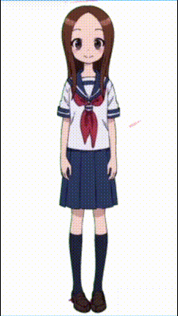
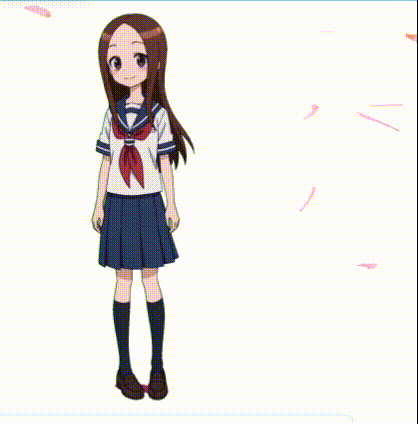
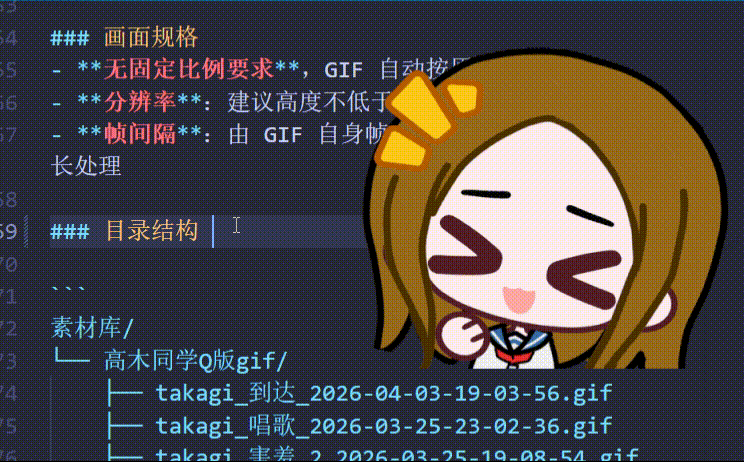
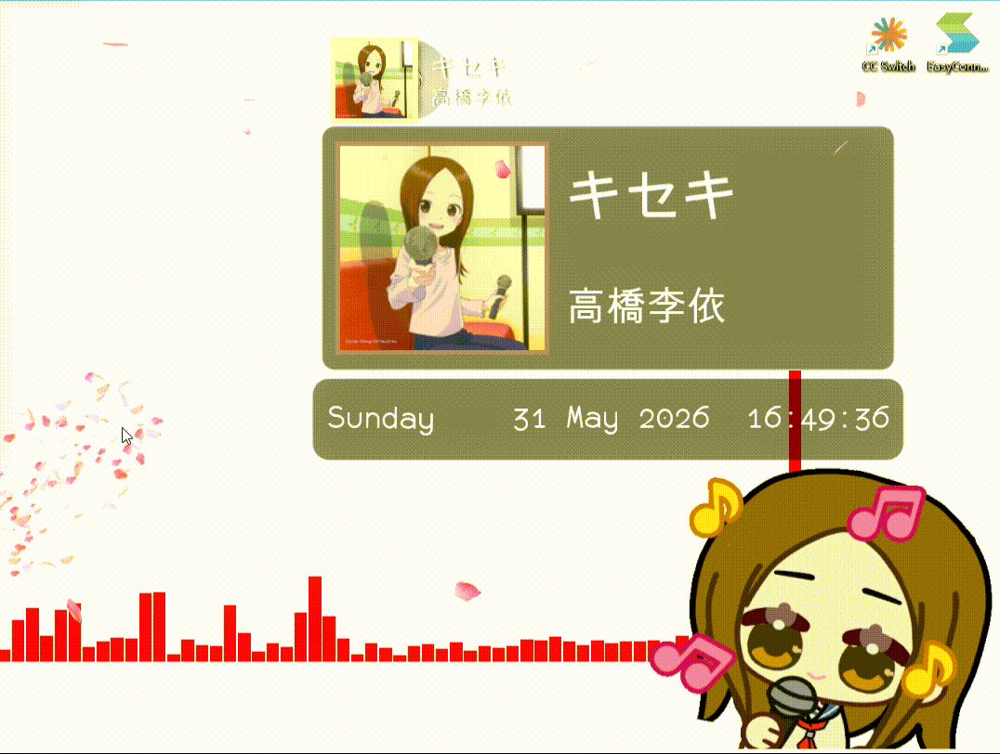
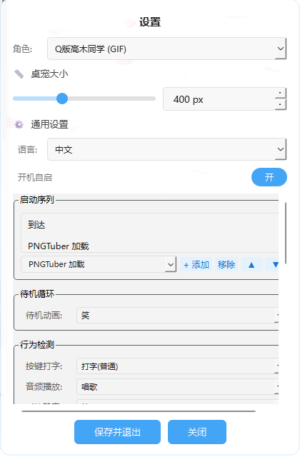
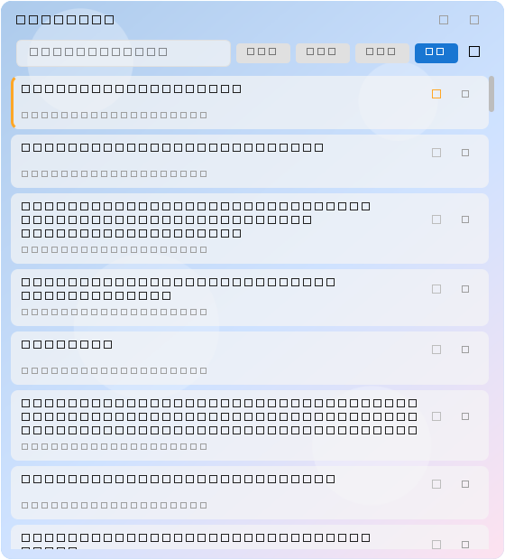

# 🐾 DesktopPet-Takagi-san — Windows 可交互桌面宠物

<div align="center">

**一只住在你桌面上的高木同学（Takagi），会对你的一举一动做出反应。**

[](https://www.python.org/)
[](https://wiki.qt.io/Qt_for_Python)
[](https://www.microsoft.com/windows)
[](LICENSE)

</div>

---

## 🎬 效果展示

### 默认服装 (PNG 帧动画)

<p align="center">
  
  <br><em>▲ 默认服装角色 — 待机 / 挥手 / 打哈欠</em>
</p>

### Q版高木同学 / Takagi (GIF 动图)

<p align="center">
  
  <br><em>▲ Q版高木同学（Takagi）— 36 种动画，完整交互状态机</em>
</p>

---

## 📖 项目简介

**DesktopPet-Takagi-san** 是一款 Windows 桌面宠物应用，使用 **Python + PySide6** 开发。它会在桌面上显示一只可爱的 **高木同学（Takagi）** 角色——透明无边框窗口悬浮显示，支持两种角色类型，能够响应鼠标悬停、点击、拖拽，还能检测键盘输入和系统音频播放，做出丰富的互动反应。

项目采用**策略模式**设计角色系统，PNG 帧动画角色和 GIF 动图角色共享统一的抽象接口，可运行时热切换。

---

## ✨ 核心功能

### 🎭 双角色系统

| 角色 | 类型 | 播放引擎 | 素材来源 |
|------|------|----------|----------|
| **默认服装** | PNG 帧序列 | QTimer 驱动，5 秒循环 | `assets/默认服装/` |
| **Q版高木同学 (Takagi)** | GIF 动图 | QMovie 原生播放 | `素材库/高木同学Q版gif/` (36 个动画) |

<p align="center">
  
  
  <br><em>▲ 左：默认服装 (PNG) / 右：Q版高木同学 Takagi (GIF)</em>
</p>

> **🔄 运行时热切换**：在设置窗口中选择角色类型，无需重启即可切换角色。

---

### 🎬 GIF 角色交互系统（Q版高木同学 / Takagi）

Q版高木同学（Takagi）拥有完整的状态机，包含 **36 种动画**，能够对你的操作做出丰富反应：

```
启动序列 → 待机循环 ⇄ 互动状态
                 ↕
            悬停待机
```

#### 🖱️ 鼠标交互

| 操作 | 触发动画 | 说明 |
|------|----------|------|
| 鼠标悬停 | 😳 害羞 | 鼠标移到角色身上 |
| 悬停 3 秒 | ❓ 问号 | 长时间悬停 |
| 单击 | 😱 惊吓 | 点击角色 |
| 双击 (400ms 内) | 😠 生气 → 😭 哭 | 链式动画，不可打断 |
| 拖拽移动 | — | 拖动角色到桌面任意位置 |

<p align="center">
  
  
  
  <br><em>▲ 悬停（害羞）/ 单击（惊吓）/ 双击（生气→哭）</em>
</p>

#### 🔍 行为检测

| 检测项 | 触发动画 | 技术实现 |
|--------|----------|----------|
| ⌨️ 键盘输入 | 打字 | `pynput` 全局键盘监听 |
| 🔊 系统音频播放 | 唱歌 | Windows Core Audio API (`IAudioMeterInformation`) |
| 🔇 系统静音 | 静音 | Windows Core Audio API (`IAudioEndpointVolume`) |

<p align="center">
  
  
  <br><em>▲ 键盘打字交互 / 音乐播放交互</em>
</p>

> 💡 键盘检测优先级高于音频检测。

#### 💤 AFK 随机播放

角色空闲 30 秒后，会从**自定义动画池**中随机选取动画播放，之后每 1-3 分钟随机播放一次（均可配置）。

---

### 💬 双面板系统

桌宠配有两套气泡面板，分别通过左键和右键触发：

| 面板 | 触发方式 | 弹出位置 | 内容 |
|------|----------|----------|------|
| **功能面板**（左键） | 左键点击角色 | 角色旁边 | 📋 历史粘贴板（可扩展更多功能） |
| **系统面板**（右键） | 右键点击角色 | 鼠标光标位置 | ⚙ 设置 · 📌 窗口置顶 · 🖥 桌面层级 · ➖ 最小化到托盘 · 🚪 退出 |

<p align="center">
  
  <br><em>▲ 毛玻璃气泡面板（滑入 + 淡入动画）</em>
</p>

> **系统面板**在鼠标光标位置弹出（类系统菜单风格），含窗口置顶/桌面层级切换（互斥 radio-like）和最小化到托盘功能。**功能面板**在角色旁边滑入淡出（220ms），方向自适应桌面剩余空间。两个面板互斥——打开一个时自动隐藏另一个。

---

### ⚙️ 设置窗口

毛玻璃风格设置窗口，双页面设计 (QStackedWidget)，420×640：

<p align="center">
  
  <br><em>▲ 设置窗口（Q版高木同学 / Takagi 配置页）</em>
</p>

| 设置区域 | 内容 |
|----------|------|
| ⚙️ **通用设置** | 角色类型切换、桌宠大小 (200–800px)、语言切换、开机自启 |
| 🎬 **动画设置** (PNG) | 待机动画选择、悬停动画选择（自动扫描 `assets/` 目录） |
| 🚀 **启动序列** (GIF) | 自定义启动动画链（添加 / 移除 / 排序） |
| 🎭 **行为检测** (GIF) | 按键打字、音频播放、系统静音对应的动画映射 |
| 🖱️ **鼠标交互** (GIF) | 悬停、长悬停、单击、双击链、面板按钮、关闭按钮的动画映射 |
| 💤 **AFK** (GIF) | 启用开关、空闲超时、随机间隔、动画池勾选 |

> 关闭时会自动检测未保存修改并提示。

---

### 📋 历史粘贴板

内置剪贴板历史管理器，记录你复制过的文本和图片。窗口为**无边框磨砂卡片**，按正常窗口逻辑运行（出现在任务栏、不置顶、可鼠标缩放、可最小化），并有专属图标。

<p align="center">
  
  <br><em>▲ 历史粘贴板窗口（正常窗口逻辑，可缩放/最小化）</em>
</p>

<p align="center">
  
  <br><em>▲ 历史粘贴板专属图标（项目头像 + 剪贴板角标）</em>
</p>

| 功能 | 说明 |
|------|------|
| 📝 文本记录 | 自动记录复制的文本，支持搜索过滤 |
| 🖼️ 图片记录 | 自动保存剪贴板图片，行内预览 |
| 🔍 实时搜索 | 输入关键词实时过滤记录 |
| ⏱️ 时间筛选 | 1 天 / 3 天 / 5 天 / 全部 |
| 📌 置顶 | 重要记录固定到顶部（橙色边框标识） |
| 🗑️ 删除 | 删除不需要的记录 |
| 📋 回拷 | 点击记录即可重新复制到剪贴板 |
| ♻️ 过期清理 | 可配置保留天数（默认 7 天），自动清理过期记录 |
| 🛡️ 图片去重 | MD5 哈希去重，解决截图工具重复保存问题 |
| 🖥️ 正常窗口 | 出现在任务栏、不置顶、可被遮挡（不再是置顶工具窗） |
| ↔️ 鼠标缩放 | 拖动窗口边缘/四角自适应缩放，排版丝滑跟随 |
| 🔤 字体大小 | ⚙ 设置中全局调整 10-20px（默认 13） |
| 🖼️ 背景壁纸 | ⚙ 设置中上传本地图片作背景底图 + 亚克力磨砂叠层（可调叠层不透明度） |
| 📚 壁纸库 | 历史上传的壁纸以缩略图形式保存在设置中，单击应用 / 删除管理 |
| ➖ 最小化 | 标题栏最小化按钮，从任务栏/托盘可还原 |
| 🎨 专属图标 | 以项目头像为底叠加剪贴板角标，任务栏/标题栏共用 |

---

### 🌐 多语言支持

| 语言 | 语言代码 |
|------|----------|
| 🇨🇳 中文 | `zh` |
| 🇬🇧 English | `en` |
| 🇯🇵 日本語 | `ja` |

> 设置窗口 17+ 个文本键覆盖中/英/日三语，切换即时生效。

---

## 📦 安装与运行

### 环境要求

- **Windows 10 / 11**
- **Python 3.10+**（推荐 [python.org](https://www.python.org/downloads/) 下载安装）
- Git（可选，也可直接下载 ZIP）

### 方式一：从源码运行（推荐开发者）

```bash
# 1. 克隆仓库
git clone https://github.com/FormerlyXZ/DesktopPet.git
cd DesktopPet

# 2. （推荐）创建虚拟环境
python -m venv venv
venv\Scripts\activate

# 3. 安装依赖
pip install -r requirements.txt

# 4. 运行
python main.py
# 或双击 DesktopPet.pyw（无终端窗口启动）
```

### 方式二：下载 ZIP 包（推荐普通用户）

1. 访问 https://github.com/FormerlyXZ/DesktopPet
2. 点击绿色的 **Code** 按钮 → **Download ZIP**
3. 解压到任意目录
4. 打开命令行（在解压目录地址栏输入 `cmd` 回车）
5. 执行 `pip install -r requirements.txt`
6. 双击 `DesktopPet.pyw` 或执行 `python main.py`

### 方式三：免安装 EXE（小白用户）

在 [Releases](https://github.com/FormerlyXZ/DesktopPet/releases) 页面下载最新的 `DesktopPet-Takagi-san.zip`，解压后双击 `DesktopPet-Takagi-san.exe` 即可运行。无需安装 Python 或任何依赖。

> 💡 EXE 首次启动较慢（5-10 秒解压），请耐心等待。所有数据保存在 EXE 同目录下。

### 常见安装问题

| 问题 | 解决方法 |
|------|----------|
| `pip` 不是内部命令 | Python 安装时勾选 "Add Python to PATH"，或手动添加环境变量 |
| `pip install` 报错 | 使用国内镜像：`pip install -r requirements.txt -i https://pypi.tuna.tsinghua.edu.cn/simple` |
| 双击 `.pyw` 没反应 | 右键 → 打开方式 → 选择 Python，或直接用命令行 `python main.py` 查看报错 |
| 缺少 VC 运行库 | 下载安装 [VC++ Redistributable](https://aka.ms/vs/17/release/vc_redist.x64.exe) |

### 依赖项

| 包 | 版本 | 用途 |
|----|------|------|
| [PySide6](https://pypi.org/project/PySide6/) | ≥ 6.5.0 | Qt for Python 界面框架 |
| [pynput](https://pypi.org/project/pynput/) | ≥ 1.7 | 全局键盘/鼠标监听 |
| [comtypes](https://pypi.org/project/comtypes/) | ≥ 1.4 | Windows COM 互操作（音频检测） |

---

## 🚀 使用指南

### 首次启动

1. 运行 `python main.py` 或双击 `DesktopPet.pyw`
2. 角色将自动出现在桌面右下角（若有多显示器则出现在光标所在屏幕）
3. **右键点击**角色打开系统面板 → 选择"设置"
4. 在设置中选择角色类型、调整大小、配置动画

### 基本操作

| 操作 | 效果 |
|------|------|
| 🖱️ **鼠标悬停** (PNG) | 角色挥手 |
| 🖱️ **鼠标悬停** (GIF / Takagi) | 角色害羞 |
| 👆 **左键单击** | 弹出功能面板（历史粘贴板） |
| 🖱️ **右键单击** | 弹出系统面板（设置/置顶/托盘/退出） |
| ✋ **拖拽** | 移动角色到任意位置 |
| ⚙️ **面板 → 设置** | 打开设置窗口 |
| 🚪 **面板 → 退出** | 关闭桌宠 |

### GIF 角色（Takagi / 高木同学）额外操作

| 操作 | 效果 |
|------|------|
| 👆 **双击（400ms 内）** | 生气 → 哭（链式动画，不可打断） |
| ⌨️ **按键盘任意键** | 角色打字动画 |
| 🔊 **播放音乐/视频** | 角色唱歌动画 |
| 🔇 **系统静音** | 角色静音动画 |
| 💤 **30 秒无操作** | AFK 随机动画播放 |
| 🔔 **系统托盘** | 最小化到托盘，点击托盘图标恢复显示 |

### 自定义动画

#### PNG 角色
将帧序列放入 `assets/你的服装名/你的动作名/` 目录，文件命名为 `001.png` `002.png` …，重启后自动识别。

```
assets/
└── 你的服装名/
    └── 你的动作名/
        ├── 001.png
        ├── 002.png
        ├── 003.png
        └── ...
```

#### GIF 角色（Takagi / 高木同学）
将 GIF 文件放入 `素材库/高木同学Q版gif/`，命名格式 `takagi_{动作名}_{时间戳}.gif`，重启后自动识别。

```
素材库/高木同学Q版gif/
├── takagi_害羞_20240101.gif
├── takagi_唱歌_20240102.gif
└── ...
```

---

## 📁 项目结构

```
DesktopPet/
├── assets/                     # PNG 帧动画素材
│   └── 默认服装/               # 默认角色
│       ├── 默认待机/           # 51 帧
│       ├── 挥手/               # 38 帧
│       └── 打哈欠/             # 30 帧
├── 素材库/                     # 原始素材库
│   └── 高木同学Q版gif/        # 36 个 GIF 动画
├── screenshots/                # 截图与演示动图
├── src/                        # 源代码
│   ├── pet_window.py           # 主窗口（透明置顶无边框）
│   ├── character_base.py       # CharacterController 抽象接口
│   ├── png_character.py        # PNG 角色适配器
│   ├── gif_character.py        # GIF 角色 + 状态机 + AFK
│   ├── gif_registry.py         # GIF 文件扫描与动作名解析
│   ├── gif_settings_page.py    # Q版专用设置页 UI
│   ├── animation.py            # PNG 帧动画引擎
│   ├── bubble_panel.py         # 气泡面板
│   ├── panel_animator.py       # 面板过渡动画
│   ├── settings_window.py      # 设置窗口（双页面）
│   ├── input_monitor.py        # 全局键盘/鼠标监听
│   ├── audio_monitor.py        # Windows 音频检测
│   ├── clipboard_monitor.py    # 剪贴板变化检测
│   ├── clipboard_store.py      # SQLite 存储后端
│   ├── clipboard_window.py     # 历史粘贴板窗口
│   ├── config.py               # 配置管理（JSON 读写）
│   └── translations.py         # 中/英/日 翻译字典
├── docs/                       # 项目文档
│   ├── 01-需求规格.md          # 完整功能需求
│   ├── 02-技术方案.md          # 架构设计
│   ├── 03-设计规范.md          # UI 设计规范
│   ├── 04-开发步骤.md          # 分阶段开发步骤
│   └── clipboard/              # 粘贴板功能文档
├── devlog/                     # 开发日志
├── config.json                 # 用户配置文件
├── main.py                     # 程序入口
├── DesktopPet.pyw              # 无终端窗口启动器
├── build.spec                  # PyInstaller 打包配置
└── requirements.txt            # Python 依赖
```

---

## ⚙️ 配置说明

所有设置保存在 `config.json`，程序启动时自动加载，退出时自动保存。支持旧版 config 平滑升级（deep_merge 递归合并新增字段）。

**PNG 角色配置示例：**

```json
{
  "character_type": "png",
  "height": 500,
  "position": [2154, 989],
  "idle_animation": "默认服装/默认待机",
  "hover_animation": "默认服装/挥手",
  "auto_start": false,
  "language": "zh",
  "topmost": true
}
```

**GIF 角色（Q版高木同学）配置示例：**

```json
{
  "character_type": "gif",
  "height": 400,
  "position": [2154, 989],
  "auto_start": true,
  "language": "zh",
  "topmost": true,
  "gif": {
    "startup_sequence": ["到达", "PNGTuber 加载", "加油"],
    "idle": "加油",
    "hover": "害羞 2",
    "long_hover": "问号",
    "click": "惊吓",
    "dbl_click_seq": ["生气", "哭 1"],
    "panel": "点头",
    "close": "摇头",
    "key_press": "打字(普通)",
    "audio_playing": "唱歌",
    "audio_muted": "静音 1",
    "afk_enabled": true,
    "afk_timeout_ms": 30000,
    "afk_min_ms": 60000,
    "afk_max_ms": 180000,
    "afk_pool": ["笑", "庆祝", "蛋糕", "玫瑰", "点赞"]
  },
  "clipboard": {
    "cleanup_days": 7,
    "font_size": 13,
    "wallpaper_path": "",
    "acrylic_opacity": 55
  }
}
```

> 💡 **历史粘贴板设置**：`cleanup_days` 为自动清理天数（默认 7），`font_size` 为全局字体大小（10-20，默认 13），`wallpaper_path` 为上传的背景壁纸路径（空=磨砂底），`acrylic_opacity` 为亚克力叠层不透明度（0-100，默认 55）。可在历史窗口 ⚙ 设置对话框调整字体、背景壁纸与清理天数；窗口支持鼠标缩放、最小化，并独立显示在任务栏。

> 💡 **多显示器适配**：启动时自动校验保存的窗口坐标是否在任一已连接屏幕内。若坐标失效（如拔掉外接显示器），自动回退到光标所在屏幕右下角。`move_to_bottom_right()` 优先放在光标所在屏幕，拖拽+重新启动即记住新位置。

---

## 🔧 自行打包为 EXE

若需从源码自行打包为独立可执行文件：

```bash
pip install pyinstaller
pyinstaller build.spec
# 输出: dist/DesktopPet-Takagi-san.exe
```

`build.spec` 已配置：
- 隐藏控制台窗口 (`console=False`)
- 包含 `assets/` 和 `素材库/` 数据文件
- 自动导入 `comtypes`、`pynput` 等隐藏依赖
- EXE 数据路径自适应：读取素材从 `sys._MEIPASS`，写入配置从 `sys.executable` 同目录

---

## 📝 开发

详见项目文档：
- [需求规格](docs/01-需求规格.md) — 完整功能需求
- [技术方案](docs/02-技术方案.md) — 架构设计与技术选型
- [设计规范](docs/03-设计规范.md) — UI 设计规范
- [开发步骤](docs/04-开发步骤.md) — 分阶段执行步骤
- [动画制作规范](docs/05-动画制作规范.md) — PNG/GIF 素材制作标准
- [开发日志](devlog/) — 每日开发记录

### 开发原则

1. 阅读 `docs/` 中相关规范文档
2. 按 `docs/04-开发步骤.md` 分阶段执行
3. **每阶段后验证**再推进下一阶段
4. 默认服装行为不可引入回归
5. 更新 `devlog/` 日志

---

## 🎯 路线图

- [x] PNG 帧动画角色
- [x] 透明置顶无边框窗口 + 鼠标穿透
- [x] 毛玻璃气泡面板 + 过渡动画
- [x] 设置窗口（动画选择、大小、开机自启）
- [x] GIF 角色系统 + 交互状态机
- [x] 行为检测（键盘、音频）
- [x] AFK 随机播放
- [x] 历史粘贴板（文本 + 图片）
- [x] 多语言支持（中/英/日）
- [x] 系统托盘图标 + 最小化到托盘
- [x] 双面板系统（功能面板 + 系统面板）
- [x] 窗口层级切换（置顶 / 桌面层级）
- [x] 多显示器自适应（坐标校验 + 光标屏幕定位）
- [x] PyInstaller 打包
- [ ] 更多角色皮肤
- [ ] 插件系统

---

## 🤝 贡献

欢迎提交 Issue 和 Pull Request！

1. Fork 本仓库
2. 创建特性分支 (`git checkout -b feature/amazing-feature`)
3. 提交更改 (`git commit -m 'Add amazing feature'`)
4. 推送到分支 (`git push origin feature/amazing-feature`)
5. 创建 Pull Request

---

## 📄 许可证

本项目基于 MIT 许可证开源。详见 [LICENSE](LICENSE) 文件。

---

## 🙏 致谢

### 素材来源

- 🎬 **Q版高木同学（Takagi）GIF 表情包** 来源于 Bilibili 用户 [ALan_639263](https://space.bilibili.com/) 的视频：
  > [【EmoteLab】高木同学表情包分享](https://www.bilibili.com/video/BV1qP93BZE9t/?share_source=copy_web&vd_source=15dedc6142046e01fdb0d28a612a6d2d)
- 角色版权归原作者所有，本项目仅供个人学习使用。

### 开源项目

- [PySide6](https://wiki.qt.io/Qt_for_Python) — Qt for Python 绑定
- [pynput](https://github.com/moses-palmer/pynput) — 全局输入监听

---

<p align="center">
  <sub>Made with ❤️ by <a href="https://github.com/FormerlyXZ">FormerlyXZ</a></sub>
</p>
